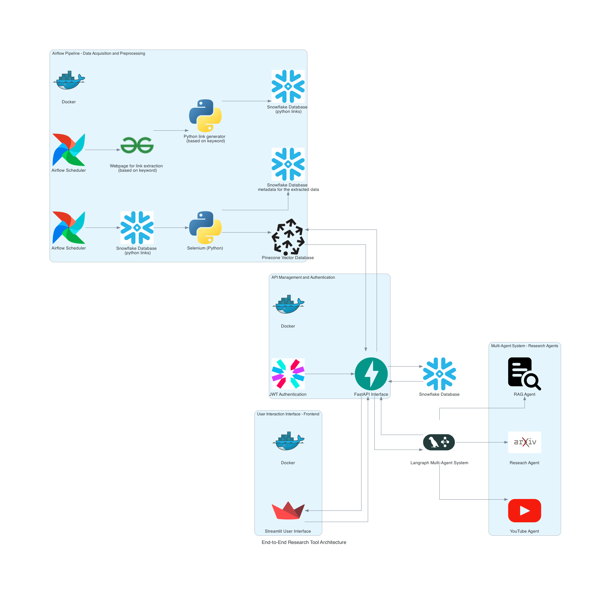

# learning_assistant

This project aims to create an interactive learning platform that integrates concept learning, video explanations, and gamified quizzes, addressing the limitations of traditional educational platforms that lack engagement and require switching between multiple tools. By using advanced technologies like multimodal agents, vector databases, and retrieval-augmented systems, the platform delivers context-aware content, personalized assessments, and a seamless user experience. The goal is to provide a one-stop solution that makes learning effective, fun, and easily accessible, enhancing retention and engagement through dynamic, gamified testing.

Project Proposal Documentation: 
[CodeLabs](https://codelabs-preview.appspot.com/?file_id=11XVdlzZ8DJotFKU9-hZb4OrUASjitlK7xsWqiVxxNzg#0)

Video Link:
[Proposal](https://northeastern-my.sharepoint.com/:v:/g/personal/gupta_abhinav_northeastern_edu/EUNqGHDd7FxGkVraUuRCt58BrV4qTsCQREB9PcfTy7xqtg?nav=eyJyZWZlcnJhbEluZm8iOnsicmVmZXJyYWxBcHAiOiJTdHJlYW1XZWJBcHAiLCJyZWZlcnJhbFZpZXciOiJTaGFyZURpYWxvZy1MaW5rIiwicmVmZXJyYWxBcHBQbGF0Zm9ybSI6IldlYiIsInJlZmVycmFsTW9kZSI6InZpZXcifX0%3D&e=fP2qOB)

[Final project] (https://github.com/BigData-saturdayT2/LearningAssistant)
